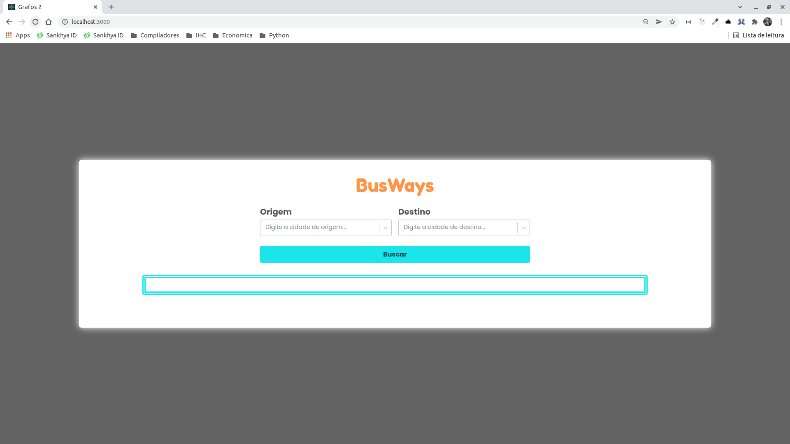
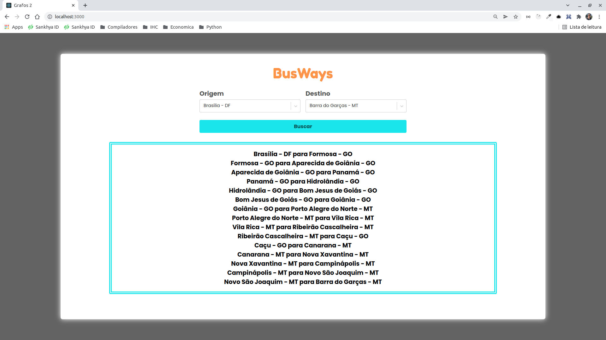

# BusWays

**Número da Lista**: 1<br>
**Conteúdo da Disciplina**: Grafos 1<br>

## Alunos
|Matrícula | Aluno |
| -- | -- |
| 18/0033034  |  Hérick Ferreira de Souza Portugues |
| 18/0114093  |  Lucas Ursulino Boaventura |

## Sobre
O objetivo do projeto é mostrar um caminho possível entre uma rodoviária e outra no Centro Oeste.

Para isso, foi contruído um crawler na pasta data para pegar as passagens disponíveis no site [De ônibus](https://deonibus.com/).

## Link da apresentação

[Apresentação](https://unbbr.sharepoint.com/sites/Pessoal909/Documentos%20Compartilhados/Forms/AllItems.aspx?id=%2Fsites%2FPessoal909%2FDocumentos%20Compartilhados%2FGeneral%2FRecordings%2FMeeting%20in%20%5FGeneral%5F%2D20220207%5F234657%2DMeeting%20Recording%2Emp4&parent=%2Fsites%2FPessoal909%2FDocumentos%20Compartilhados%2FGeneral%2FRecordings)

## Screenshots




## Instalação
**Linguagem**: JavaScript - Node v16.13.1<br>
**Framework**: ReactJS<br>
Descreva os pré-requisitos para rodar o seu projeto e os comandos necessários.

## Uso
1. Clone o projeto:
```
git clone https://github.com/projeto-de-algoritmos/Grafos1_BusWays.git
```

2. Entre na pasta do projeto:
```
cd Grafos1_BusWays
```

3. Instale as dependências do projeto:
```
yarn
```
ou
```
npm install
```

4. Rode o projeto:
```
yarn start
```
ou
```
npm start
```

5. Extra, caso queira rodar o crawler (mas demora um pouco):
```
node src/data/crawler.js
```
Para rodar o crawler mais rápido como um exemplo, passe o seguinte argumento na linha de comando:
```
node src/data/crawler.js /rodoviaria/goiania-go
```
O resultado estará no caminho src/data-exemplo.json.


